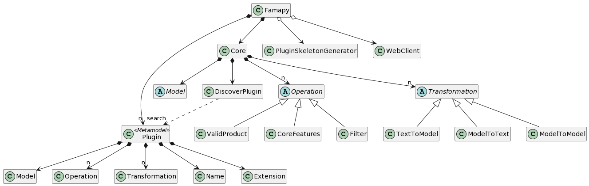

# Documentation

## How to generate .png from .puml (plantuml) from python

```
pip install plantuml
python3 -m plantuml FILE.puml
```

More info about plantuml in https://plantuml.com/


## Domain model


